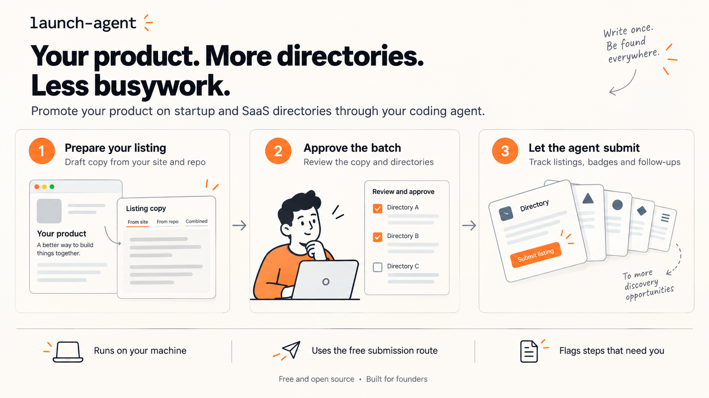
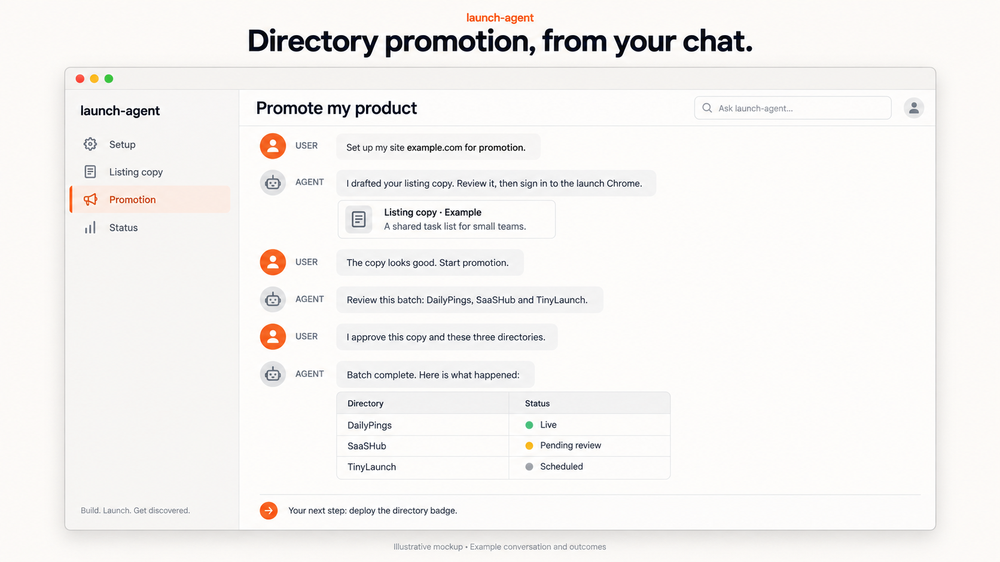

# launch-agent

**Get your product onto 30+ startup and SaaS directories without filling in the forms yourself.**

Every launch checklist says to list your product on the directories. Then you see what that
means: thirty sign-up flows, the same tagline pasted thirty times, badge embeds, upsell dialogs and
"free queue" fine print. It's a weekend of copy-paste you could spend building.

launch-agent hands that weekend to an AI agent. You approve your listing copy once. Then Claude Code
or OpenCode, driving your own Chrome, works through the directories one by one: it signs in with
Google, fills each form from your approved copy, takes the free route every time, and hands you a
short list of the few things that need a human.

Free and open source (MIT). It runs on your machine, with your own coding agent.



## Watch the explainer

[Watch Get It Listed (MP4)](get-it-listed.mp4)

## Proof: the first real run

[BuyerCue](https://www.buyercue.io) went to 17 directories in three days:

- **14 submitted.** 4 are already live and the rest are scheduled or in review.
- **$0 spent.** Paid-only directories were reported, not bought.
- **3 quick steps by hand:** an emailed sign-in code, a launch-date booking and one badge check.

| Outcome | Directories |
|---|---|
| Live, confirmed from a logged-out browser | DailyPings, Findly.tools, Startup Fame, Uno Directory |
| Launch scheduled | IndieHunt, Nick Launches, TinyLaunch |
| In the free queue | Huzzler, LaunchNest, PeerPush |
| Pending review | AlternativeTo, PitchWall, SaaSHub, ToolDirs |
| Not submitted | Uneed (already listed), LaunchBoard (free slots full that week; reported as paid-only, nothing bought), SaaSworthy (skipped: emailed code plus a bot check) |

Free queues are long (Huzzler's goes live in December), so listings keep landing for weeks after
the run. This section will be updated as they do.

## How it works

Clone the repo, open Claude Code, Codex or OpenCode in the folder, and talk to it:

1. **"Set up my site myproduct.com for promotion."** Point it at your product's repo, or answer a
   few questions. It drafts your taglines, descriptions, launch comment, categories and tags from
   your code and site, and goes through them with you until they read right.
2. **"Start promotion."** You sign a dedicated Chrome profile into your launch Google account, once.
3. **Approve a batch.** It proposes the best-fit directories. Cut any you don't want and approve
   the rest.
4. **Let it work.** It submits a few at a time, collects every directory's badge into one file for
   your site, and tells you exactly what needs you. Ask "what's the status?" whenever you like.



*Illustrative mockup with an example conversation and outcomes.*

## Safe to leave alone

**It will:**

- Submit only the copy you approved, written from your own site, repo and answers
- Sign in with Google, fill each directory's form and upload your logo and screenshots
- Take the free route every time and turn down the upsells
- Finish each directory's badge check once the badge is live on your site
- Check that each listing is live from a logged-out browser

**It won't:**

- Type anything that isn't in your approved copy
- Pay for anything
- Enter passwords or solve CAPTCHAs
- Leave the directory's own site
- Submit founder-led launches like Product Hunt or Show HN. Those stay with you

These limits are enforced in code, not left to the prompt: see
[How it stays safe](HOW_TO.md#how-it-stays-safe). launch-agent is for listing your own product
once per directory through each directory's normal free route. It is not a tool for mass
submissions.

## 57 directories, and growing

DailyPings, Uneed, TinyLaunch, Peerlist Launchpad, SaaSHub, AlternativeTo, IndieHunt, Startup Fame,
Microlaunch, Huzzler, PeerPush, SideProjectors and more. 15 are already proven in a real run. See
[the full list](HOW_TO.md#directories), with sign-in, free route and badge rules for each.

Building in the open? OpenAlternative, Open Source Startups, OpenSourceAlternative.to and LibHunt are
in the list too. They accept open-source projects only, so they're proposed only after you confirm
your product's public repo and its open-source license. Self-hosted apps also fit selfh.st.

Shipping an MCP server? MCP Market, mcpservers.org, Glama and four more MCP directories are in the
list. They're proposed only for a product that is or ships an MCP server, once you confirm it.

## Quick start

You need macOS with Chrome, Node.js 20+, Claude Code, Codex or OpenCode, and a Google account for
launches.

```bash
git clone https://github.com/apsquared/launch-agent.git && cd launch-agent
npm install
```

Then open your coding agent in that folder and say: **"Set up my site myproduct.com for
promotion."**

**[HOW_TO.md](HOW_TO.md) has everything else:** requirements, running it without a chat agent,
the safety rules, agent backends, badges, per-directory instructions and the full directory list.

> **Status:** early. Used in production for one product so far, on macOS. Expect rough edges, and
> expect directories to change their forms under you.

## Contributing

Know a directory that's missing, or did one change its form? Directory playbooks are the most
useful contribution. [CONTRIBUTING.md](CONTRIBUTING.md) explains the playbook format, how to share
what your runs learned, and the rules for code changes. Security problems go through
[private reporting](SECURITY.md).

## Also from the maker

launch-agent manages directory promotion for [BuyerCue](https://www.buyercue.io) and
[Idea Launch](https://www.idea-launch.io). If you're a founder, they might help you too:

- **[BuyerCue](https://www.buyercue.io):** find SaaS companies that already pay for growth, with
  sourced, dated evidence and a public way to reach them.
- **[Idea Launch](https://www.idea-launch.io):** find out whether people want your idea with real
  ads on Facebook, Instagram or Reddit, before you build it. No ad account needed, and ad costs are
  included.

## License

[MIT](LICENSE)
